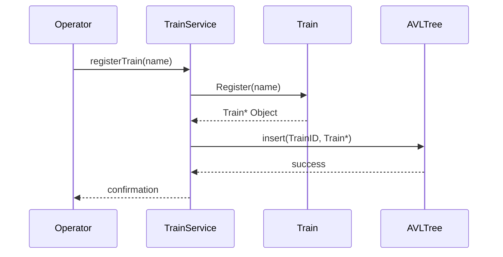
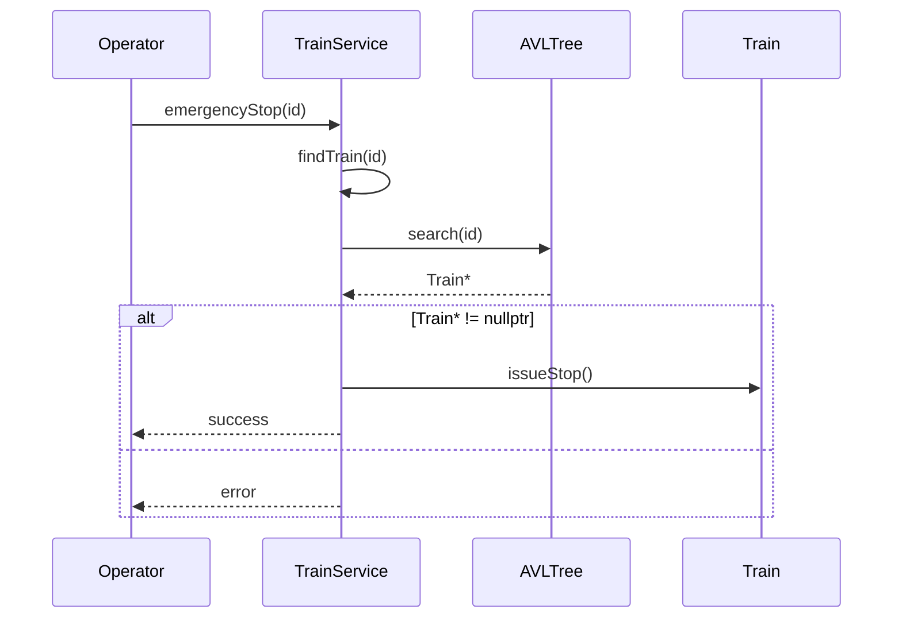
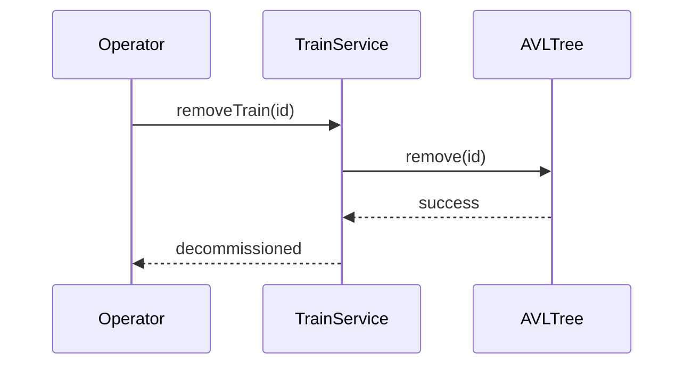
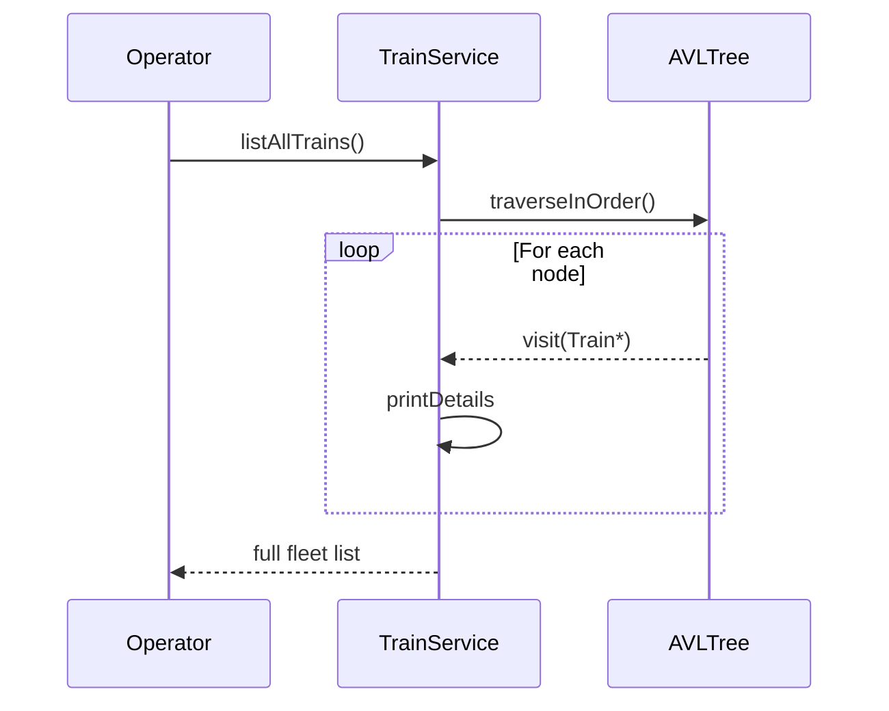

# Module 1: Sequence Diagrams (Train Registry)

This document provides sequence diagrams using the exact C++ signatures from the `TrainService` and `Train` skeletons.

---

## 1. Register a New Train (FR-1.3)

---

## 2. Find Train / Emergency Stop (FR-1.2)

---

## 3. Remove a Train (FR-1.3)

---

## 4. List All Trains / Fleet Patrol (FR-1.4)

