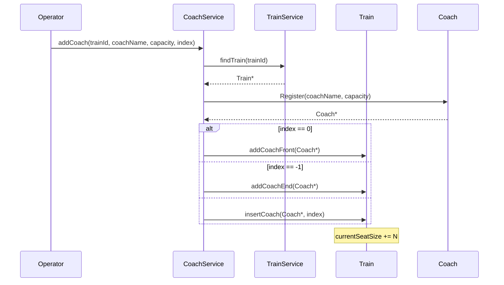
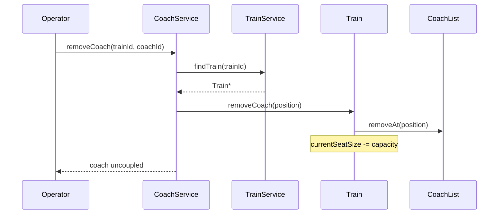
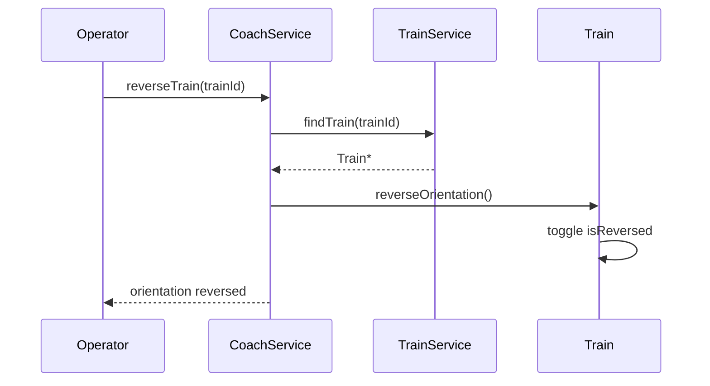
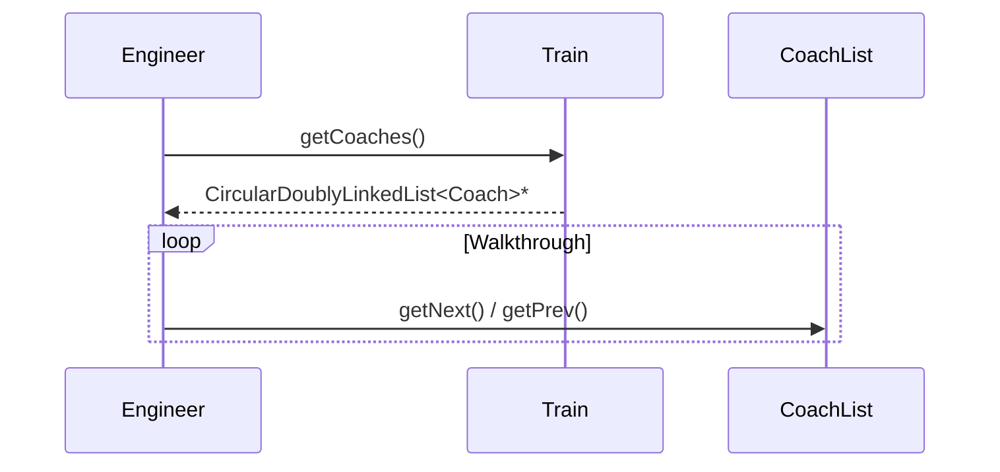

# Module 2: Sequence Diagrams (Coach Management)

This document provides sequence diagrams using the exact C++ signatures from the `CoachService` and `Train` skeletons.

---

## 1. Add Coach to Train (FR-2.1)

---

## 2. Remove Coach for Maintenance (FR-2.2)

---

## 3. Reverse Train Orientation (FR-2.4)

---

## 4. Traverse Train / Engineer Walkthrough (FR-2.3)

