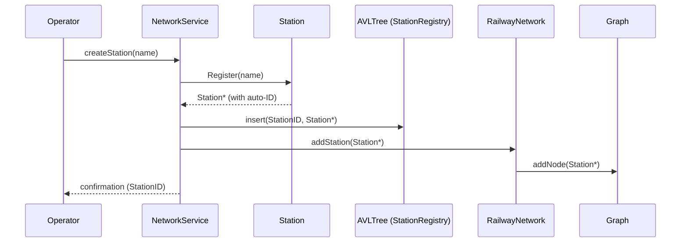
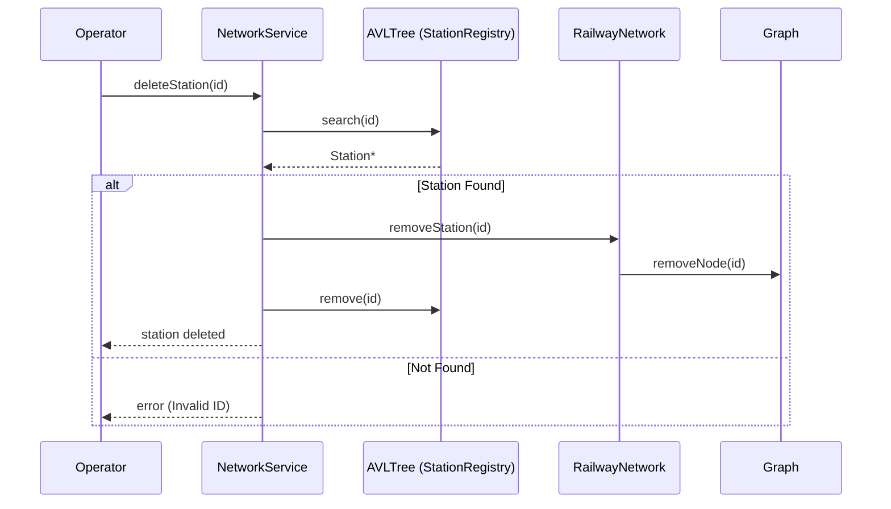
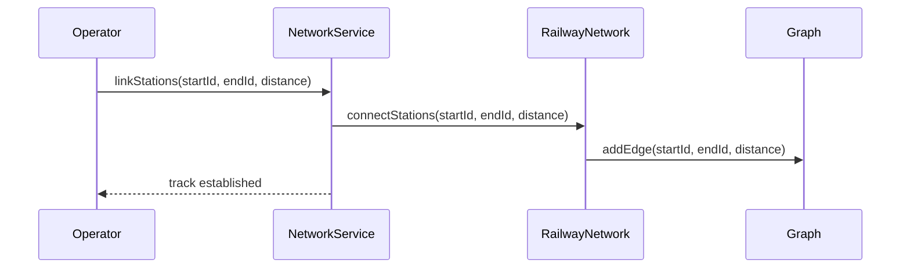
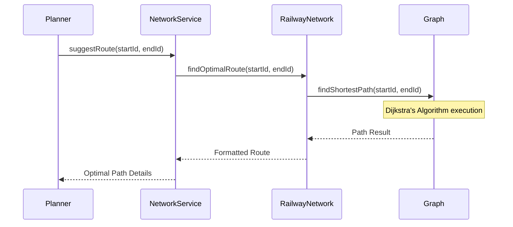
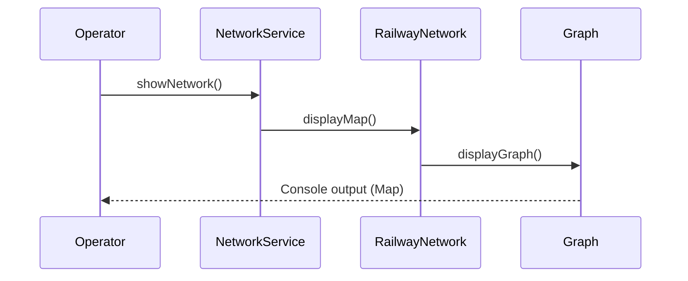

# Module 3: Sequence Diagrams (Railway Network)

This document provides sequence diagrams for the core functional requirements of the Railway Network module, based on the `NetworkService` and `RailwayNetwork` signatures.

---

## 1. Create a New Station
Operators can expand the network by adding up to 15 major hubs.

---

## 2. Delete a Station
Decommissioning a station involves removing it from the registry and pruning all connected tracks.

---

## 3. Link Two Stations (Add Track)
Establishing a connection between two hubs with a distance metric.

---

## 4. Suggest Optimal Route (Dijkstra)
Calculating the most efficient path by shortest distance.

---

## 5. Show Network Map
Displaying the current connectivity of the railway system.

