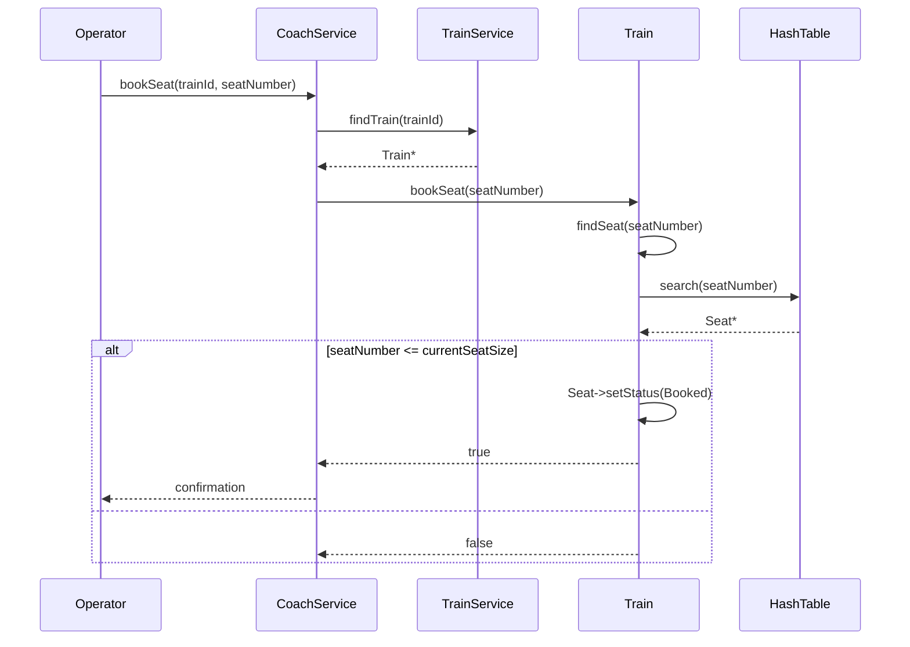
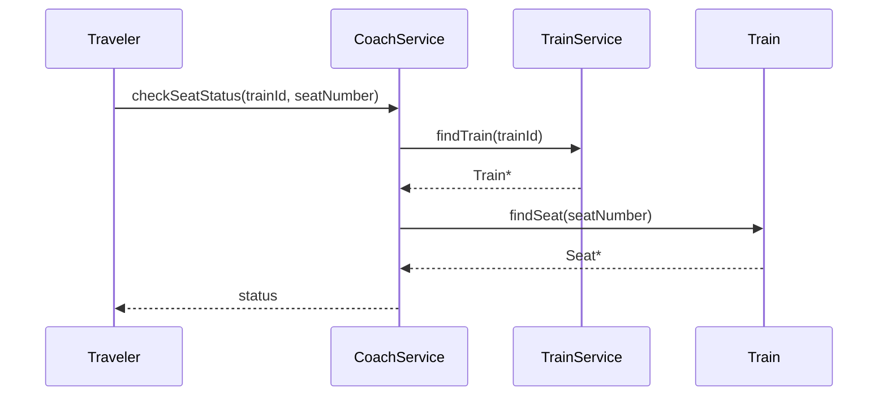
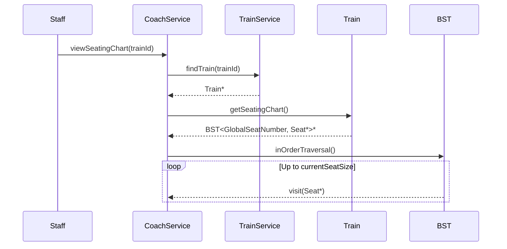
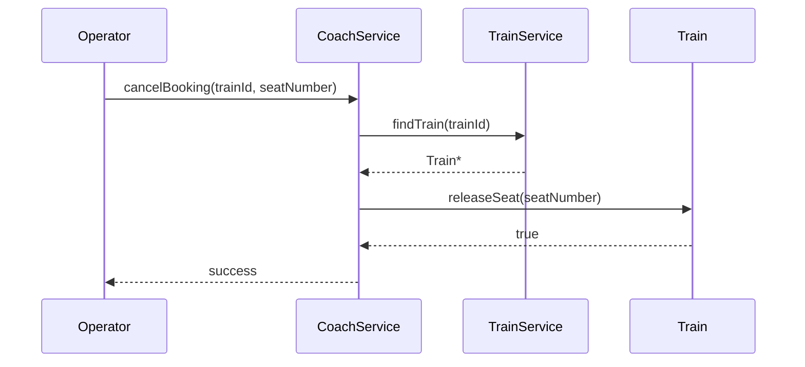

# Module 4: Sequence Diagrams (Seating Chart)

This document provides sequence diagrams using the exact C++ signatures from the `CoachService` and `Train` skeletons.

---

## 1. Book Seat (FR-4.5)

---

## 2. Check Seat Status / Inquiry (FR-4.2, FR-4.6)

---

## 3. View Ordered Seating Chart (FR-4.4)

---

## 4. Cancel Seat Booking (FR-4.5)

