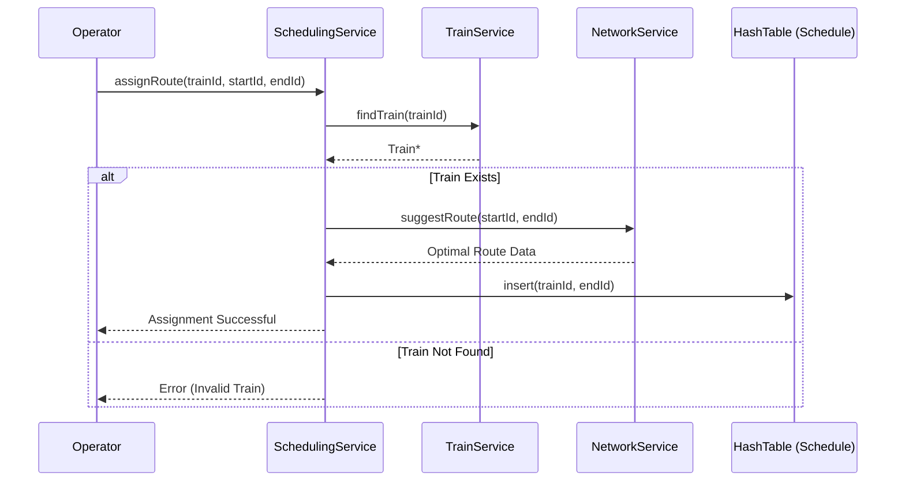
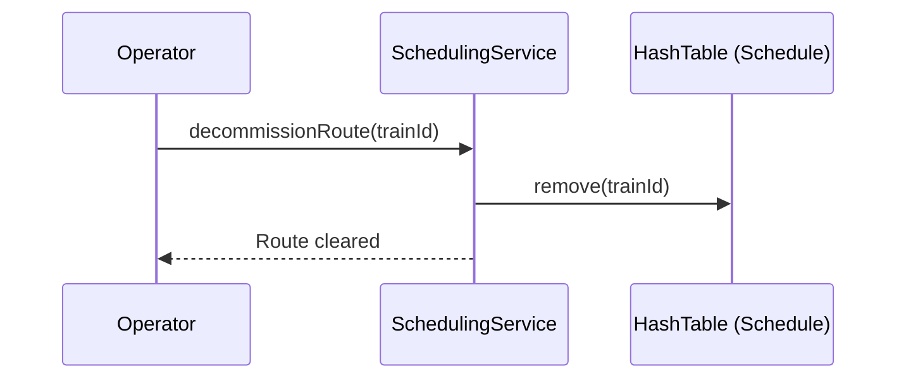

# Scheduling Service: Sequence Diagrams

This document provides sequence diagrams for assigning trains to routes, linking Module 1 (Trains) and Module 3 (Network).

---

## 1. Assign Train to Route
Assigns a specific train to a path calculated between two stations.

---

## 2. Decommission Train Route
Removes a train from its active assignment.

